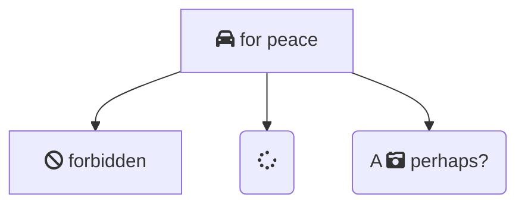

# Source
```xml
<foo>
  <bar a="42"/>
</foo>
```
# Graphics

## `Graphviz` (svg)

```{.graphviz im_opt="-Gsize=4,1.5" caption="Created by Graphviz"}

digraph finite_state_machine {
  rankdir=LR;
  size="6,3"
  node [shape = doublecircle]; LR_0 LR_3 LR_4 LR_8;
  node [shape = circle];
  LR_0 -> LR_2 [ label = "SS(B)" ];
  LR_0 -> LR_1 [ label = "SS(S)" ];
  LR_1 -> LR_3 [ label = "S($end)" ];
  LR_2 -> LR_6 [ label = "SS(b)" ];
  LR_2 -> LR_5 [ label = "SS(a)" ];
  LR_2 -> LR_4 [ label = "S(A)" ];
  LR_5 -> LR_7 [ label = "S(b)" ];
  LR_5 -> LR_5 [ label = "S(a)" ];
  LR_6 -> LR_6 [ label = "S(b)" ];
  LR_6 -> LR_5 [ label = "S(a)" ];
  LR_7 -> LR_8 [ label = "S(b)" ];
  LR_7 -> LR_5 [ label = "S(a)" ];
  LR_8 -> LR_6 [ label = "S(b)" ];
  LR_8 -> LR_5 [ label = "S(a)" ];
}

```

## `mscgen`

```mscgen
msc {

   # The entities
   A, B, C, D;

   # Small gap before the boxes
   |||;

   # Next four on same line due to ','
   A box A [label="box"],
   B rbox B [label="rbox"],
   C abox C [label="abox"],
   D note D [label="note"];

   # Example of the boxes with filled backgrounds
   A abox B [label="abox", textbgcolour="#ff7f7f"];
   B rbox C [label="rbox", textbgcolour="#7fff7f"];
   C note D [label="note", textbgcolour="#7f7fff"];
}
```

## mermaid



## mermaid (svg)

```{.mermaid im_opt="-H 300" im_fmt="svg"}
sequenceDiagram
    Alice ->> Bob: Hello Bob, how are you?
    Bob-->>John: How about you John?
    Bob--x Alice: I am good thanks!
    Bob-x John: I am good thanks!
    Note right of John: Bob thinks a long<br/>long time, so long<br/>that the text does<br/>not fit on a row.

    Bob-->Alice: Checking with John...
    Alice->John: Yes... John, how are you?
```
